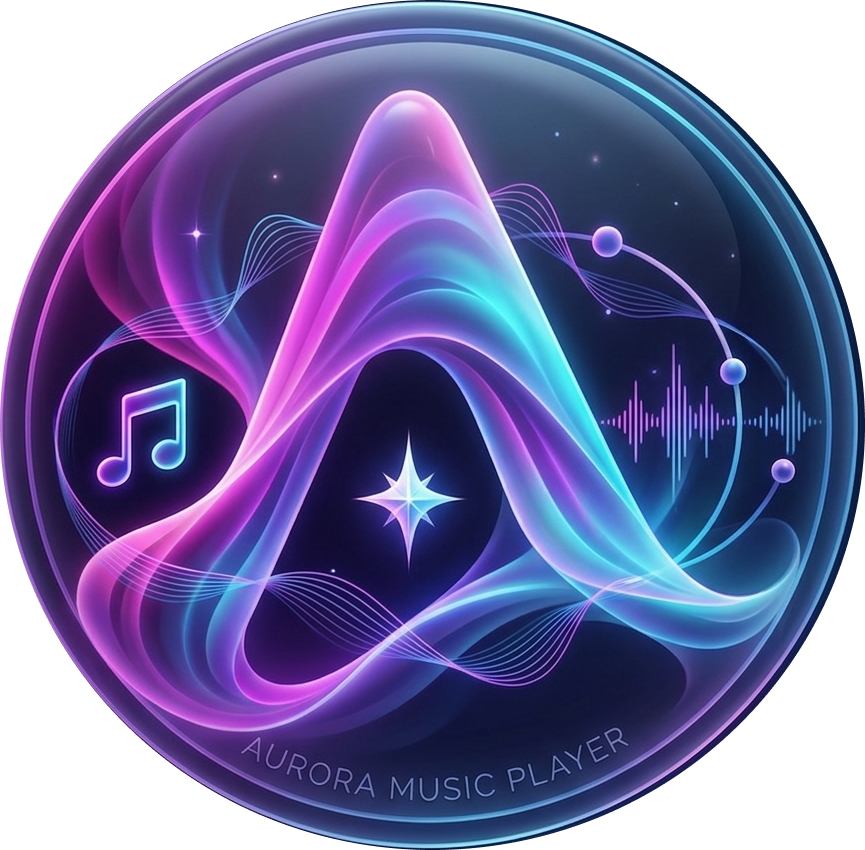
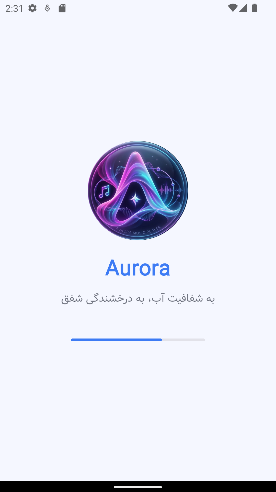
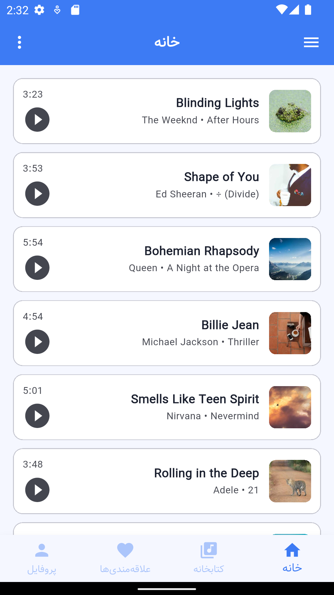
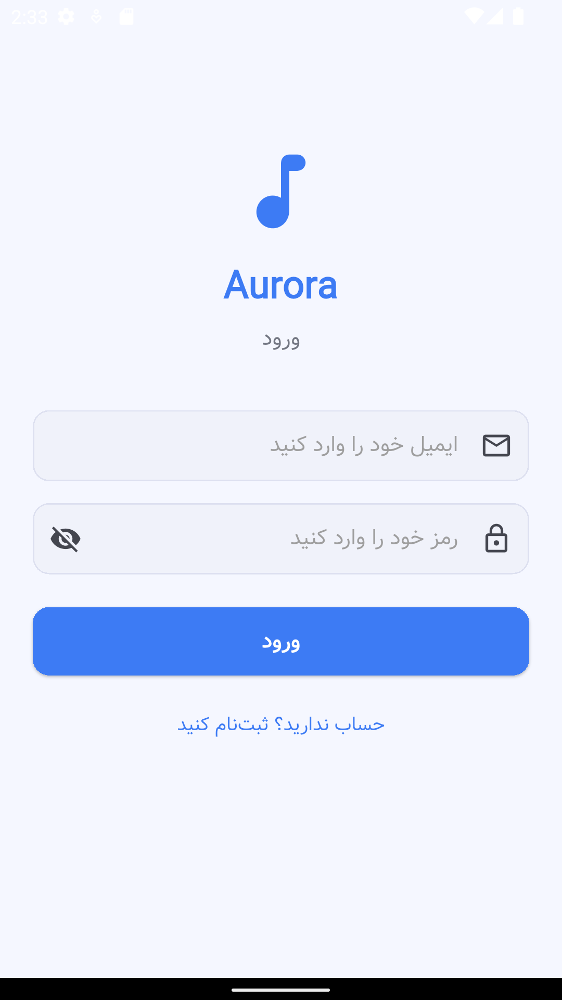
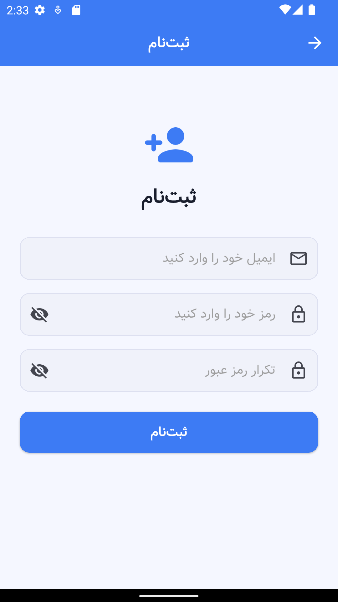
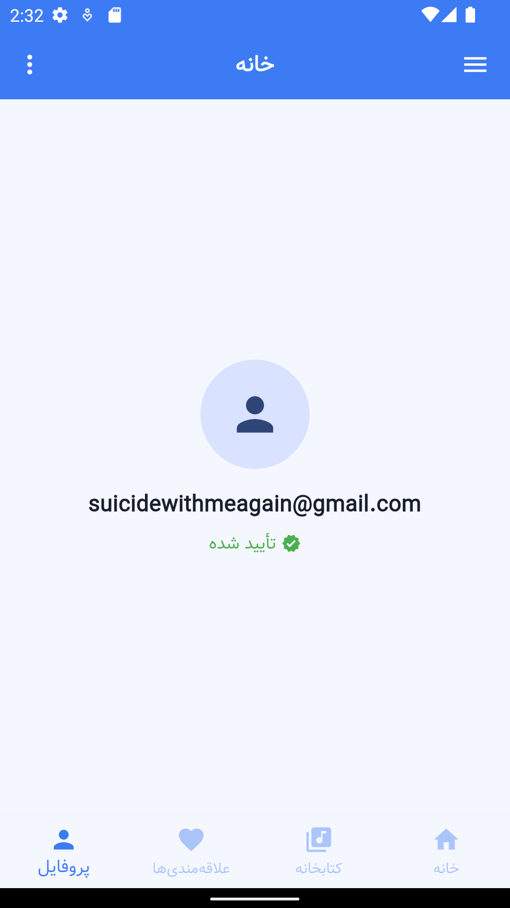
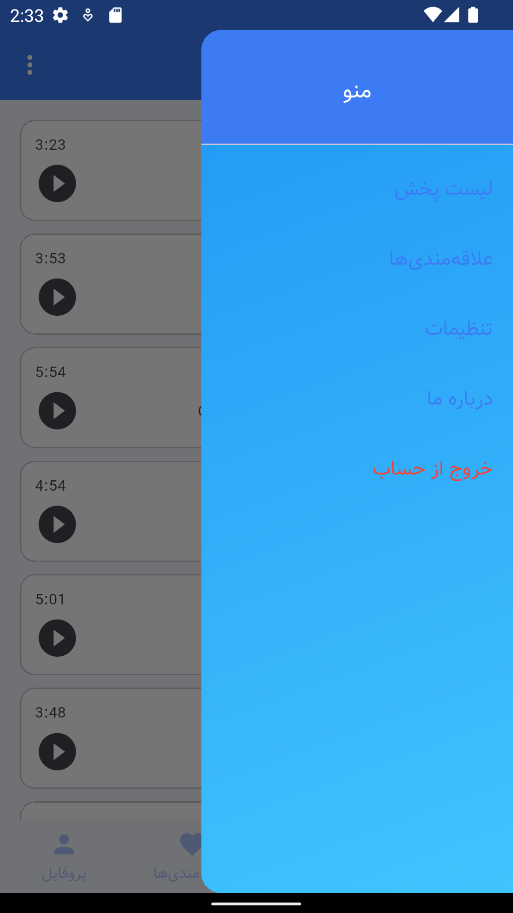
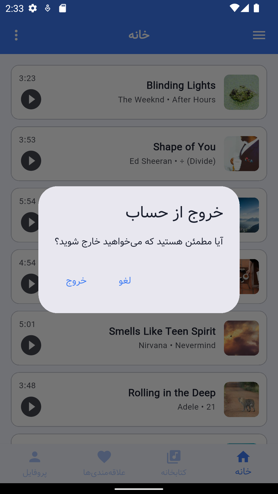
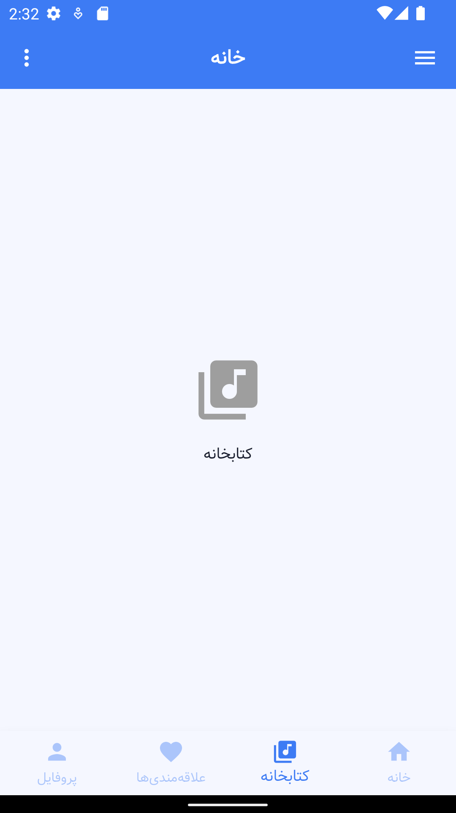

<div align="center">



# Aurora Music Player

**به شفافیت آب، به درخشندگی شفق**

[](https://flutter.dev/)
[](https://dart.dev/)
[](https://firebase.google.com/)
[](LICENSE)
[](https://flutter.dev/multi-platform)

A modern, cross-platform music player built with Flutter — focused on clean architecture, smooth UX, and reliable audio playback.

[Features](#-features) • [Screenshots](#-screenshots) • [Tech Stack](#-tech-stack) • [Getting Started](#-getting-started) • [Architecture](#-architecture) • [Roadmap](#-roadmap)

</div>

---

## ✨ Features

### Currently Available
- 🎵 **Online Music Streaming** — Fetches and streams songs from a remote JSON source
- 🔐 **Firebase Authentication** — Secure sign-up, login, and email verification flow
- 🎨 **Light & Dark Theme** — Full Material 3 theme support with automatic system switching
- 🌍 **RTL & Persian Support** — Full Farsi localization with Vazir font
- ▶️ **Playback Controls** — Play, pause, resume, and stop with real-time progress tracking
- 📋 **Song List** — Cover art, artist info, duration, and active song highlighting
- 🔁 **Smart Caching** — Songs cached locally for 10 minutes to reduce redundant requests
- 💬 **Error Handling** — User-friendly Persian error messages for all failure cases

### In Development
- [ ] Playlist creation and management
- [ ] Background audio with media notification
- [ ] Favorites and library organization
- [ ] Local file playback
- [ ] Settings page (equalizer, sleep timer, quality)
- [ ] Offline mode with local database (Hive)

---

## 📸 Screenshots

| Splash | Home | Login | Register |
|--------|------|------|---------|
|  |  |  |  |

| Profile | Menu | Logout-Dialog | Library |
|---------|-----|------------|---------|
|  |  |  |  |
---

## 🛠 Tech Stack

| Category | Technology |
|---|---|
| Framework | Flutter 3.x |
| Language | Dart 3.x |
| Authentication | Firebase Auth |
| Remote Data | REST API over HTTP |
| Audio | `audioplayers` |
| Navigation | GoRouter |
| State | `ChangeNotifier` (PlayerService) |
| Equality | `equatable` |
| Localization | `flutter_localizations` (fa_IR) |
| Font | Vazir |

---

## 🚀 Getting Started

### Prerequisites

- [Flutter SDK](https://docs.flutter.dev/get-started/install) `>=3.0.0`
- [Dart SDK](https://dart.dev/get-dart) `>=3.0.0`
- A Firebase project with **Authentication** enabled (Email/Password)
- Android Studio or VS Code with Flutter extension

### Installation

```bash
# 1. Clone the repository
git clone https://github.com/GoldenTitab/First-App.git
cd First-App

# 2. Install dependencies
flutter pub get

# 3. Configure Firebase
# Replace lib/firebase_options.dart with your own generated file:
# flutterfire configure

# 4. Run the app
flutter run
```

### Environment

No `.env` file is needed. Firebase configuration is handled by `firebase_options.dart`.  
Make sure **Email/Password** sign-in is enabled in your Firebase Console under Authentication → Sign-in methods.

---

## 🏗 Architecture

Aurora follows a **layered architecture** separating concerns into models, services, views, widgets, and utilities.

```
lib/
├── models/
│   └── song.dart               # Song model with Equatable + copyWith
│
├── services/
│   ├── auth_service.dart       # Firebase Auth singleton
│   ├── song_service.dart       # HTTP fetch + 10-min cache singleton
│   └── player_service.dart     # AudioPlayer singleton (ChangeNotifier)
│
├── views/
│   ├── splash_screen.dart      # Animated splash with RTL progress bar
│   ├── login_view.dart         # Form-validated login
│   ├── register_view.dart      # Form-validated register + confirm password
│   ├── verify_email_view.dart  # Email verification polling
│   └── home_page.dart          # Main 4-tab layout
│
├── widgets/
│   ├── song/
│   │   ├── song_list_view.dart
│   │   ├── song_list_item.dart
│   │   ├── song_player_controls.dart
│   │   └── song_progress_indicator.dart
│   ├── custom_bottom_navigation_bar.dart
│   ├── custom_dialog.dart
│   ├── custom_drawer.dart
│   ├── custom_elevated_button.dart
│   ├── custom_text_field.dart  # TextFormField + visibility toggle
│   └── loading_overlay.dart
│
├── utils/
│   ├── app_routes.dart         # GoRouter with auth redirect
│   ├── app_theme.dart          # Full light + dark Material 3 themes
│   ├── constants.dart          # Strings, durations, validators
│   └── exception_handler.dart  # Firebase + generic error mapping
│
├── app.dart                    # MaterialApp.router entry
├── main.dart                   # Firebase init + error handlers
└── firebase_options.dart       # Auto-generated by FlutterFire CLI
```

### Key Design Decisions

**Singleton Services** — `AuthService`, `SongService`, and `PlayerService` are all singletons. This ensures a single source of truth for auth state, cached data, and audio playback across the entire app.

**GoRouter with Auth Redirect** — Navigation is handled declaratively. The router's `redirect` callback checks Firebase auth state and email verification on every route change, eliminating the need for a separate `AuthWrapper` widget.

**PlayerService as ChangeNotifier** — Audio state (`isPlaying`, `currentPosition`, etc.) lives inside `PlayerService` which extends `ChangeNotifier`. Views subscribe via `addListener` and rebuild only when needed.

**Form Validation** — All input forms use Flutter's `Form` + `GlobalKey<FormState>` with `AutovalidateMode.onUserInteraction`, so errors appear as the user types rather than only on submit.

---

## 📦 Dependencies

```yaml
dependencies:
  flutter:
    sdk: flutter
  firebase_core: ^3.x.x
  firebase_auth: ^5.x.x
  audioplayers: ^6.4.0
  http: ^1.x.x
  go_router: ^14.0.0
  equatable: ^2.0.5
  flutter_localizations:
    sdk: flutter
```

---

## 🗺 Roadmap

### v1.0 — Foundation ✅
- [x] Firebase Authentication with email verification
- [x] Remote song fetching with cache
- [x] Audio playback (play / pause / stop)
- [x] GoRouter navigation with auth guard
- [x] Form validation on all input screens
- [x] Full light/dark theme
- [x] RTL + Persian localization

### v1.1 — Player Experience
- [ ] Mini player persistent at bottom of all tabs
- [ ] Seek bar interaction (tap to seek)
- [ ] Next / Previous track controls
- [ ] Background audio + lock screen controls (`audio_service`)

### v1.2 — Library & Personalization
- [ ] Favorites system (Firestore)
- [ ] Custom playlists
- [ ] Recently played history
- [ ] Search and filter

### v2.0 — Offline & Advanced
- [ ] Local file playback
- [ ] Offline cache with Hive
- [ ] Equalizer
- [ ] Sleep timer
- [ ] Cross-fade between tracks

---

## 🤝 Contributing

This project is part of an active learning journey. Contributions, issues, and suggestions are welcome.

1. Fork the repository
2. Create your feature branch: `git checkout -b feature/your-feature`
3. Commit your changes: `git commit -m 'feat: add your feature'`
4. Push to the branch: `git push origin feature/your-feature`
5. Open a Pull Request

Please follow [Conventional Commits](https://www.conventionalcommits.org/) for commit messages.

---

## 📄 License

This project is licensed under the MIT License. See the [LICENSE](LICENSE) file for details.

---

<div align="center">

Built with ❤️ by [GoldenTitab](https://github.com/GoldenTitab)

*Aurora Studio — where clarity meets resonance*

</div>